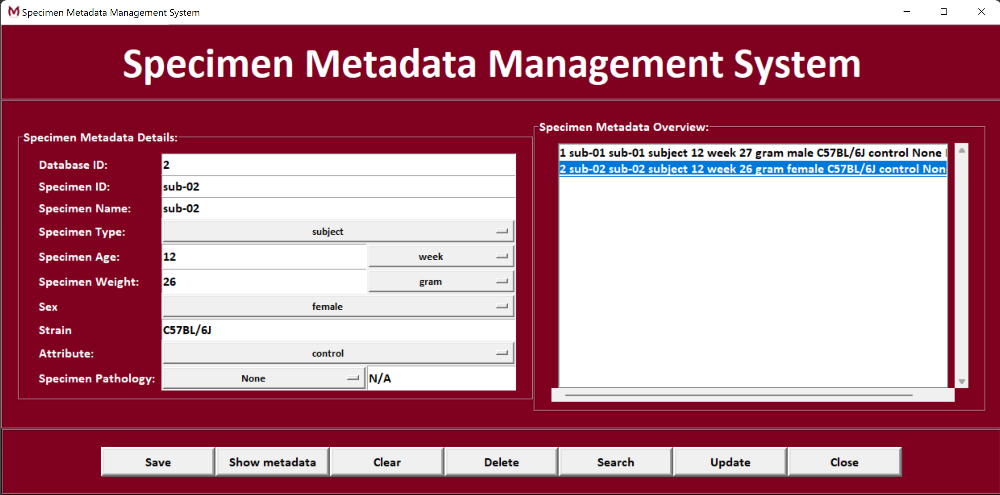

# Metadata Management System for Specimen

Graphical user interface for the organisation and storage of specimen metadata (conform the openMINDS metadata standard) with a SQLite3 backend. All metadata is stored in a database table (SpecimenList.db).

  

## How to Use
Enter the metadata details for each subject into the left panel "Specimen Metadata Details".

``Save``: Save the entered metadata to the database.

``Show metadata``: To review all metadata available in the database. A list will appear in the right panel "Specimen Metadata Overview". Clicking on one of the entries allows you to update or change the metadata in the left panel. Any updated information can be saved by pressing the "update" button.

``Clear``: Remove all entered metadata from the boxes without saving or updating the entry in the database.

``Delete``: Select an entry in the overview list and delete this from the database.

``Search``: Enter metadata in the left panel and search for matching entries in the database.

``Update``: Update or change metadata already in the database.

``Close``: Close the application. Unsaved changes will be discarded.
